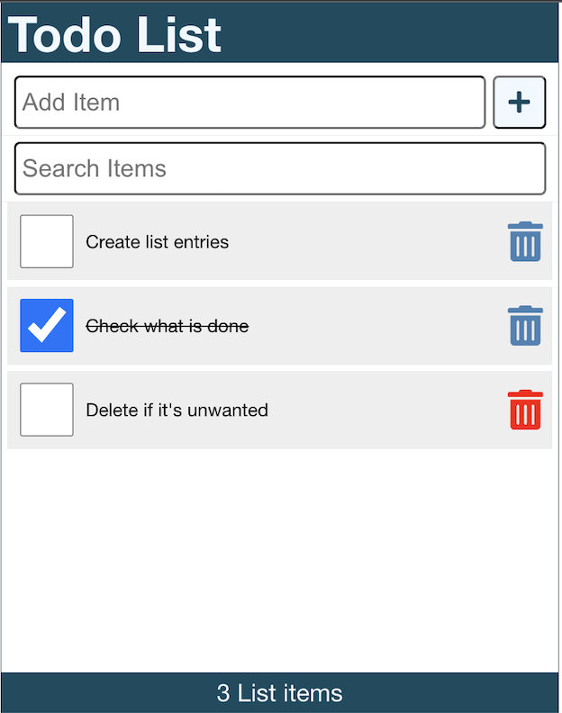

<h2 align="center">Todo List</h3>

<p align="center">
    project_description
    <br />
    <a href="https://github.com/sutogabor/TodoList/tree/main/todolist"><strong>Explore the docs »</strong></a>
    <br />
    <br />
    </p>

<!-- TABLE OF CONTENTS -->
<details>
  <summary>Table of Contents</summary>
  <ol>
    <li>
      <a href="#about-the-project">About The Project</a>
      <ul>
        <li><a href="#built-with">Built With</a></li>
      </ul>
    </li>
    <li>
      <a href="#getting-started">Getting Started</a>
      <ul>
        <li><a href="#prerequisites">Prerequisites</a></li>
        <li><a href="#installation">Installation</a></li>
      </ul>
    </li>
    <li><a href="#usage">Usage</a></li>
    <li><a href="#contact">Contact</a></li>
  </ol>
</details>


<!-- ABOUT THE PROJECT -->
## About The Project

<div align="center">
  
</div>


This Todo List is a simple application for everyday use that helps you manage your most important tasks throughout the day.


### Built With

* [![React][React.js]][React-url]


<!-- GETTING STARTED -->
## Getting Started

Welcome to my Todo List project! This project is a simple web application built with React that allows you to organise your everyday tasks in an easy straight-forward fashion.
### Prerequisites

Make sure you have the Node.js installed on your computer!<br>
* [Node.js](https://nodejs.org/) (v14 or higher)


### Installation

The following terminal commands will set up the application on your computer:

1. Clone the repository to your local machine using Git:
   ```
   git clone https://github.com/sutogabor/TodoList.git
   ```
2. Navigate to the project directory through your terminal:
   ```
   cd todolist
   ```
3. Install the project dependencies using npm: 
   ```
   npm install
   ```


<p align="right">(<a href="#readme-top">back to top</a>)</p>


### Starting the application

Once you completed the installation, and you've opened the repository in your respective IDE you need to do the following steps:
1. Start a json server using port 3500, and watching the data/db.json file. You can do this with the following command:
```
npx json-server -p 3500 -w data/db.json
```

2. Open a new terminal window and start the application on default port (3000):
```
npm start
```

## Usage

After everything is set up you can open the application the url
```
http://localhost:3000/
```
through your browser.
There you will see the application ready to use, and after a quick load previous list entries (if there were any) will show up on the list.<br>
* You can add new entries to the list by filling the "New entry" input field and pressing the "Enter" key, or clicking on the plus icon.<br>
* You can search entries by typing in the search entries field.<br>
* You can delete your entries by clicking on the "Trashcan icon" next to the respective entry.<br>

## Contact

Sütő Gábor - [@LinkedIn](https://linkedin.com/in/sutogabor) - [@GitHub](https://github.com/sutogabor) - suto.gabor.86@gmail.com

Project Link: [https://github.com/sutogabor/TodoList](https://github.com/sutogabor/TodoList)

<p align="right">(<a href="#readme-top">back to top</a>)</p>

[product-screenshot]: images/screenshot.png
[React.js]: https://img.shields.io/badge/React-20232A?style=for-the-badge&logo=react&logoColor=61DAFB
[React-url]: https://reactjs.org/